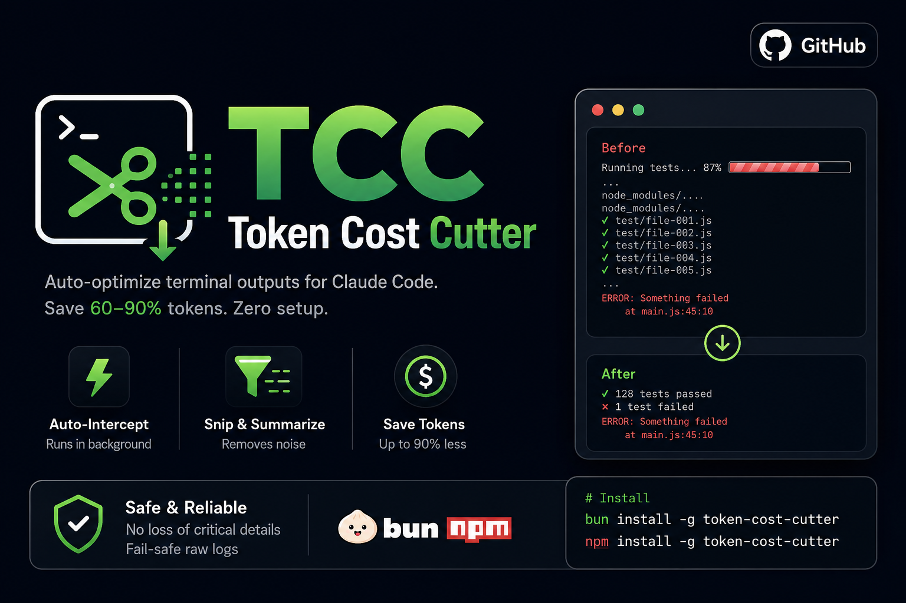

# Token Cost Cutter (TCC)

<p align="center">
  
</p>

Auto-optimize terminal outputs for Claude Code. Save 60–90% tokens with zero setup.

🌐 [tcc.kodelyx.in](https://tcc.kodelyx.in)

---

## Quick Start

**1. Install globally**
```bash
# Via Bun
bun install -g token-cost-cutter

# Via NPM
npm install -g token-cost-cutter
```

**2. Connect to Claude Code**
```bash
tcc init -g
```
Restart Claude Code after running this.

---

## How It Works

1. **Auto-Intercept** — Runs silently when Claude executes shell commands.
2. **Optimize** — Strips ANSI noise, deduplicates logs, removes empty lines.
3. **Save Tokens** — Delivers compact output to Claude, reducing costs by up to 90%.

---

## Check Your Savings

```bash
tcc gain              # Total tokens and cost saved
tcc gain --history    # Recent command breakdown
tcc gain --graph      # 30-day ASCII savings chart
```

All data is stored locally in SQLite. Nothing leaves your machine.

---

## Accuracy & Reliability

- **Zero Loss** — Only strips structural noise. Compile errors, test failures, and stack traces stay intact.
- **Improves AI Accuracy** — Clean data helps Claude isolate bugs faster instead of getting lost in massive logs.
- **Fail-Safe Tee Mode** — On failure, full raw output is saved to a temp file so Claude can access it instantly.

---

## Links

- 🌐 Website: [tcc.kodelyx.in](https://tcc.kodelyx.in)
- 📦 NPM: [token-cost-cutter](https://www.npmjs.com/package/token-cost-cutter)
- 🐙 GitHub: [kodelyx/token-cost-cutter](https://github.com/kodelyx/token-cost-cutter)
